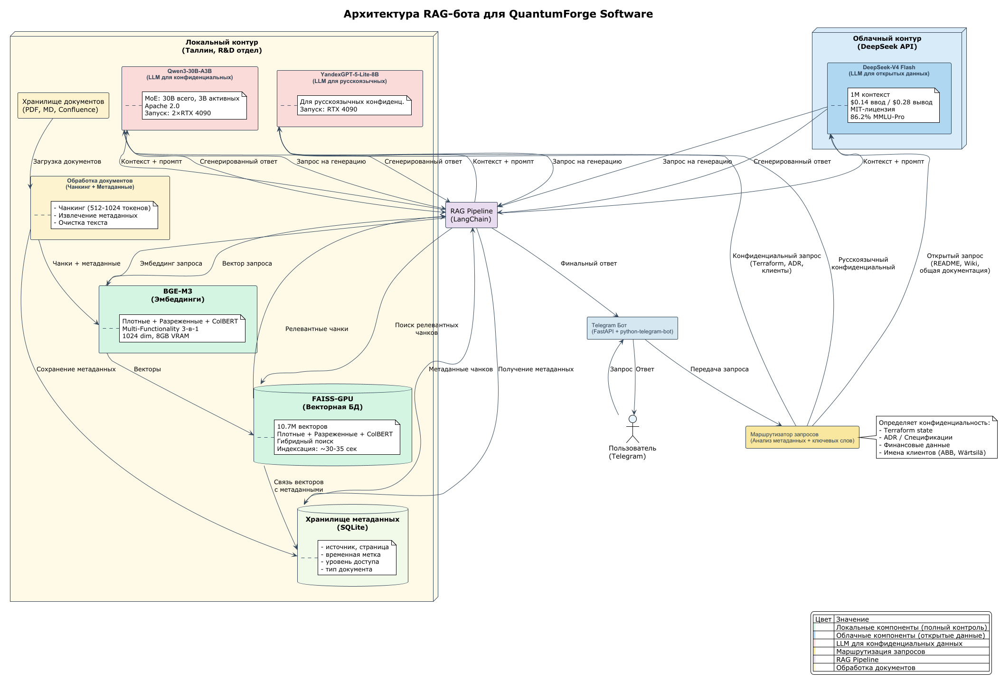

## Раздел 1. Исследование моделей и инфраструктуры

### 1.1. Сравнение LLM-моделей

#### Введение

Компания QuantumForge Software - финско-эстонский разработчик SaaS-платформы «Digital Twin» с распределённой командой (Хельсинки, Таллин). База знаний содержит ≈21 000 документов и растёт на 400 страниц ежемесячно. Конечный продукт - чат-бот в Telegram на основе RAG.

Ключевые требования, которые я определил для выбора модели:
- Безопасность: часть документации содержит конфиденциальную информацию, которую нельзя отправлять в публичные облачные API (требования SOC 2, GDPR). Компания расположена в ЕС, поэтому выбор облачных провайдеров должен учитывать европейское законодательство.
- Качество: точные, контекстно-релевантные ответы на русском, финском и английском языках.
- Скорость: время ответа ≤ 3–5 секунд (поиск + генерация).
- Масштабируемость: выдерживать рост базы знаний (400 страниц/месяц).
- Стоимость: баланс между капитальными затратами (оборудование) и операционными затратами (API-платежи).

#### Сравнительная таблица моделей

Я рассмотрел облачные модели OpenAI (доступны в ЕС через Azure или прямой API) и локальные модели с открытыми весами, которые показали наилучшие результаты на 2026 год. Цены я указал в долларах США за 1 миллион токенов (ввод / вывод) на основе [llm-stats.com](https://llm-stats.com) и официальных прайсов.

| Модель                                   | Качество ответов                                                           | Скорость (ток/с) | Стоимость ($/1M)               | Контекстное окно           | Развёртывание             | Лицензия   | Источник                                                                                       |
|------------------------------------------|----------------------------------------------------------------------------|------------------|--------------------------------|----------------------------|---------------------------|------------|------------------------------------------------------------------------------------------------|
| GPT-5.5 Pro (OpenAI)                     | Максимальное, рассуждения, параллельные вычисления                         | ~20–40           | $30.00 ввод / $180.00 вывод    | 1 050 000                  | API (ЕС)                  | -          | [llm-stats](https://llm-stats.com)                                                             |
| GPT-5.5 (OpenAI)                         | Флагман, программирование, цепочка рассуждений                             | 61–82            | $5.00 / $30.00                 | 1 050 000                  | API (ЕС)                  | -          | [llm-stats](https://llm-stats.com)                                                             |
| GPT-4.1 (OpenAI)                         | Высокое качество, оптимизирована для RAG                                   | ~100             | $2.00 / $8.00                  | 1 047 576                  | API (ЕС)                  | -          | [llm-stats](https://llm-stats.com)                                                             |
| GPT-4.1-mini (OpenAI)                    | Оптимальна для корпоративных RAG-систем                                    | ~100–150         | $0.40 / $1.60                  | 1 047 576 / 32 768 (вывод) | API (ЕС)                  | -          | [llm-stats](https://llm-stats.com)                                                             |
| GPT-4.1-nano (OpenAI)                    | Лёгкая, простые задачи                                                     | ~100–150         | $0.10 / $0.40                  | 1 047 576                  | API (ЕС)                  | -          | [llm-stats](https://llm-stats.com)                                                             |
| DeepSeek-V4 Flash (DeepSeek)             | Высокое, приближается к V4-Pro, 86.2% MMLU-Pro, 96.7% AIME 2026            | Высокая          | $0.14 / $0.28                  | 1 000 000                  | API или локально (2×H100) | MIT        | [DeepSeek](https://deepseek.com)                                                               |
| Llama 3.1 8B (локальная)                 | Среднее, для базовых задач                                                 | 34–37            | Бесплатно (GPU ≥8GB)           | 128K                       | Ollama / vLLM             | -          | [Meta](https://llama.meta.com)                                                                 |
| Qwen 30B-A3B (локальная)                 | Высокое, оптимизирована для RAG, MoE                                       | ~49.5            | Бесплатно (GPU ≥24GB)          | 32K (до 131K)              | vLLM / SGLang             | Apache 2.0 | [Hugging Face](https://huggingface.co/Qwen/Qwen3-30B-A3B)                                      |
| YandexGPT-5-Lite-8B-instruct (локальная) | Высокое, обучена на русском, превосходит аналоги в русскоязычных сценариях | ~20–40           | Бесплатно (GPU ≥8GB)           | 32K                        | vLLM / Hugging Face       | -          | [Hugging Face](https://huggingface.co/yandex/YandexGPT-5-Lite-8B-instruct)                     |
| Llama 4 Scout (локальная)                | Высокое, мультимодальная, поддерживает контекст до 10M токенов             | -                | Бесплатно (высокие требования) | 10 000 000                 | Локально (много GPU)      | -          | [Hugging Face](https://huggingface.co/blog/daya-shankar/open-source-llm-models-to-run-locally) |
| Phi-4-mini (локальная)                   | Хорошее, MIT-лицензия, работает на CPU                                     | -                | Бесплатно (4–8GB RAM)          | 128K                       | CPU / GPU                 | MIT        | [Hugging Face](https://huggingface.co/blog/daya-shankar/open-source-llm-models-to-run-locally) |

> Примечания:
> - Все локальные модели бесплатны при развёртывании, но требуют затрат на оборудование (капитальные затраты) и электроэнергию.
> - Для локальных моделей скорость может варьироваться в зависимости от аппаратного обеспечения.
> - Облачные сервисы Yandex Cloud юридически доступны в ЕС, но их использование связано с санкционными и репутационными рисками, поэтому я рассматриваю только локальную версию YandexGPT.

#### Анализ стоимости облачных моделей

Я сравнил цены на модели OpenAI и DeepSeek относительно базовой - GPT-4.1-mini:

| Модель            | Ввод ($/1M) | Вывод ($/1M) | Во сколько раз дороже GPT-4.1-mini |
|-------------------|-------------|--------------|------------------------------------|
| DeepSeek-V4 Flash | $0.14       | $0.28        | В 2.9–5.7 раз ДЕШЕВЛЕ              |
| GPT-4.1-mini      | $0.40       | $1.60        | 1x (базовая)                       |
| GPT-4.1           | $2.00       | $8.00        | Ввод: 5x, Вывод: 5x                |
| GPT-5.5           | $5.00       | $30.00       | Ввод: 12.5x, Вывод: 18.75x         |
| GPT-5.5 Pro       | $30.00      | $180.00      | Ввод: 75x, Вывод: 112.5x           |

Мой вывод по ценам:
- DeepSeek-V4 Flash - самая экономичная модель среди облачных решений. Она дешевле GPT-4.1-mini в 2.9 раза по входным и 5.7 раз по выходным токенам.
- GPT-4.1-mini - вторая по доступности облачная модель, оптимальна для 95% корпоративных RAG-запросов.
- GPT-5.5 и GPT-5.5 Pro - только для узких, критически важных задач, где требуется максимальное качество.

#### Выбор стратегии для QuantumForge Software

С учётом требований конфиденциальности, бюджета и языковой поддержки я предлагаю гибридный подход с маршрутизацией запросов:

| Сценарий                                             | Рекомендуемая модель                       | Обоснование                                                                                                                    |
|------------------------------------------------------|--------------------------------------------|--------------------------------------------------------------------------------------------------------------------------------|
| Открытые запросы (основной поток)                    | DeepSeek-V4 Flash (API)                    | Самая низкая стоимость ($0.14/$0.28) при высоком качестве и 1M контексте. Экономия бюджета до 70% по сравнению с GPT-4.1-mini. |
| Открытые запросы (сложные инженерные)                | DeepSeek-V4 Flash (API, режим рассуждений) | Режим рассуждений даёт глубину, приближающуюся к V4-Pro.                                                                       |
| Конфиденциальные данные (основной)                   | DeepSeek-V4 Flash (локально)               | MIT-лицензия, 1M контекста. Требует 2×H100. Если оборудование недоступно - Qwen 30B-A3B.                                       |
| Конфиденциальные русскоязычные данные                | YandexGPT-5-Lite-8B-instruct (локально)    | Превосходит аналоги в русскоязычных сценариях.                                                                                 |
| Конфиденциальные данные + сверхдлинные документы     | Llama 4 Scout (локально)                   | Контекст 10M токенов для работы с архивами и юридическими документами.                                                         |
| Конфиденциальные данные на ограниченном оборудовании | Phi-4-mini (локально)                      | Работает даже на CPU, минимальные требования к ресурсам.                                                                       |

#### Моя итоговая рекомендация по модели

Основная модель для всех сценариев - DeepSeek-V4 Flash:

1. Для открытых запросов: использовать через API по цене $0.14/$0.28. Это в 3–6 раз дешевле GPT-4.1-mini при сопоставимом качестве и таком же контекстном окне в 1M токенов.
2. Для конфиденциальных запросов: развернуть локально на 2×H100 (если бюджет позволяет). Если нет - использовать Qwen 30B-A3B как альтернативу с меньшими требованиями к оборудованию (≥24GB VRAM).
3. Для русскоязычных сценариев: использовать YandexGPT-5-Lite-8B-instruct как специализированное решение (локально).
4. Для сверхдлинных документов (>1M): Llama 4 Scout с контекстом 10M токенов.

#### Моё заключение по разделу 1.1

DeepSeek-V4 Flash - оптимальный выбор для QuantumForge Software:

- Цена: самая низкая на рынке ($0.14/$0.28), экономия до 70% бюджета
- Качество: 86.2% MMLU-Pro, 96.7% AIME 2026, 79% SWE-bench
- Контекст: 1M токенов - идеально для работы с технической документацией
- Гибкость: работает и как API, и локально (2×H100)
- Лицензия: MIT - без ограничений для коммерческого использования

Это единственная модель, которая одновременно:
1. Даёт качество, близкое к топовым закрытым моделям
2. Стоит на порядок дешевле
3. Поддерживает 1M контекста
4. Может быть развёрнута локально для конфиденциальных данных
5. Имеет свободную лицензию MIT

Я рекомендую сделать DeepSeek-V4 Flash основной моделью для обоих сценариев (открытые запросы - через API, конфиденциальные - локально при наличии 2×H100 или через Qwen 30B-A3B как альтернативу).

#### Источники:
- [llm-stats.com](https://llm-stats.com)
- [OpenAI Pricing](https://openai.com/api/pricing/)
- [DeepSeek Official](https://deepseek.com)
- [Hugging Face - локальные модели 2026](https://huggingface.co/blog/daya-shankar/open-source-llm-models-to-run-locally)
- [Meta Llama](https://developer.meta.com/ai/llama-downloads/)
- [Qwen3-30B-A3B](https://huggingface.co/Qwen/Qwen3-30B-A3B)
- [YandexGPT-5-Lite-8B-instruct](https://huggingface.co/yandex/YandexGPT-5-Lite-8B-instruct)

### 1.2. Сравнение моделей эмбеддингов

#### Введение

Эмбеддинг-модель определяет качество семантического поиска в RAG-системе. Для QuantumForge Software критически важны мультиязычность (русский, финский, английский) и полный контроль над данными. Исходя из требований безопасности (SOC 2, GDPR), я рассматриваю только локальные модели с открытыми лицензиями.

#### Сравнительная таблица локальных эмбеддинг-моделей (2026)

| Модель             | MTEB  | VRAM    | Лицензия      | Multi-Functionality             |
|--------------------|-------|---------|---------------|---------------------------------|
| Harrier-OSS-v1-27B | ~74.3 | 80GB+   | MIT           | Только плотные векторы          |
| Jina v5-text-small | 71.7  | ~8GB    | CC BY-NC 4.0* | Только плотные векторы          |
| Qwen3-Embedding-8B | 70.58 | ~16GB   | Apache 2.0    | Только плотные векторы          |
| BGE-M3             | 63.0  | ≥8GB    | MIT           | Плотные + Разреженные + ColBERT |
| all-MiniLM-L6-v2   | 56.3  | CPU/2GB | Apache 2.0    | Только плотные векторы          |

> * Jina v5 требует коммерческой лицензии у Elastic для использования в коммерческих продуктах.

#### Ключевые параметры

Скорость индексации (на T4 GPU):
- all-MiniLM-L6-v2: ~500 эмбеддингов/сек
- BGE-M3: ~200–300 эмбеддингов/сек
- Остальные: зависят от VRAM

Безопасность: все модели локальные → полный контроль данных, соответствие SOC 2/GDPR.
Стоимость: модели бесплатны, требуется только капитальные затраты на GPU.

---

#### Архитектурный выбор: BGE-M3 vs Qwen3-Embedding-8B

| Критерий          | BGE-M3  | Qwen3-Embedding-8B   |
|-------------------|---------|----------------------|
| VRAM              | 8 GB    | 16 GB                |
| Разреженный поиск | Встроен | Нужен отдельный BM25 |
| ColBERT           | Встроен | Нет                  |
| MTEB              | 63.0    | 70.58                |
| Лицензия          | MIT     | Apache 2.0           |

BGE-M3 - единственная модель, дающая гибридный поиск из коробки (плотные + разреженные + ColBERT) без отдельного BM25 индекса. Для технической документации QuantumForge (API, ADR, SCADA, Terraform) это критическое преимущество - экономит инфраструктуру и время разработки.

Qwen3-Embedding-8B даёт более высокий MTEB (70.58) и MRL для гибкой размерности, но требует отдельного BM25 индекса для точных терминов.

---

#### Моя рекомендация

| Сценарий                         | Рекомендуемая модель | Обоснование                                                                                               |
|----------------------------------|----------------------|-----------------------------------------------------------------------------------------------------------|
| Основной выбор                   | BGE-M3               | 3-в-1 (плотные + разреженные + ColBERT), 8GB VRAM, MIT-лицензия, не требует дополнительной инфраструктуры |
| Альтернатива (максимальный MTEB) | Qwen3-Embedding-8B   | 70.58 MTEB, Apache 2.0, MRL, требует 16GB VRAM + отдельный BM25                                           |
| Максимальное качество            | Harrier-OSS-v1-27B   | ~74.3 MTEB, требует 80GB+ VRAM                                                                            |
| Прототипирование                 | all-MiniLM-L6-v2     | Максимальная скорость, минимальные требования                                                             |

#### Итоговый вывод

Для QuantumForge Software я рекомендую BGE-M3 как основную модель эмбеддингов:

1. Multi-Functionality 3-в-1 - единственная модель с плотными + разреженными + ColBERT из коробки
2. Экономия инфраструктуры - не нужен отдельный BM25 индекс
3. Минимальные требования - всего 8GB VRAM
4. MIT-лицензия - полностью свободна для коммерческого использования
5. Полный контроль данных - локальное развертывание соответствует SOC 2/GDPR
6. Мультиязычность - поддержка русского, финского, английского

Qwen3-Embedding-8B рассматриваю как альтернативу при необходимости максимального MTEB (70.58) и MRL, но с учётом дополнительной инфраструктуры для BM25.

Облачные модели полностью исключаю из-за рисков утечки данных и нарушения регуляторных требований.

#### Источники:
- [MTEB Leaderboard](https://huggingface.co/spaces/mteb/leaderboard)
- [BGE-M3](https://huggingface.co/BAAI/bge-m3)
- [Qwen3-Embedding-8B](https://huggingface.co/Qwen/Qwen3-Embedding-8B)
- [Jina v5-text-small (лицензия)](https://huggingface.co/jinaai/jina-embeddings-v5-text-small)

### 1.3. Сравнение векторных баз ChromaDB и FAISS

#### Введение

Векторная база данных хранит эмбеддинги и обеспечивает семантический поиск. Для QuantumForge Software, где в разделе 1.2 выбрана BGE-M3 с Multi-Functionality (плотные + разреженные + multi-vector), критически важна поддержка всех трёх типов представлений. Я сравниваю ChromaDB и FAISS с учётом этого требования.

#### Сравнительная таблица ChromaDB vs FAISS

| Параметр                           | ChromaDB                                         | FAISS                                                            | Обоснование выбора                                                                                                                         |
|------------------------------------|--------------------------------------------------|------------------------------------------------------------------|--------------------------------------------------------------------------------------------------------------------------------------------|
| 1. Скорость поиска и индексации    | ~8 мс (CPU), индексация 1M ~45 сек               | ~0.3 мс (GPU), индексация 1M ~3 сек                              | FAISS значительно быстрее благодаря GPU. При масштабе 10.7M векторов (ColBERT) разница критична для ответов в реальном времени.            |
| 2. Сложность внедрения и поддержки | Простая (pip install, 5 строк кода)              | Средняя (20+ строк, требуется настройка индексов)                | ChromaDB проще, но FAISS управляема, особенно с учётом готовых обёрток в LangChain.                                                        |
| 3. Удобство в работе               | Встроенные CRUD, метаданные, постоянное хранение | Требует ручной реализации постоянного хранения, метаданных, CRUD | ChromaDB удобнее, но недостатки FAISS компенсируются использованием SQLite для метаданных и автоматическим сохранением через pickle.       |
| 4. Стоимость владения              | Низкая (CPU, минимальная инфраструктура)         | Высокая (GPU для производительности)                             | FAISS требует GPU (капитальные затраты), но окупается при масштабе >1M векторов. Для 10.7M векторов - единственное масштабируемое решение. |

#### Ключевое различие: поддержка Multi-Functionality BGE-M3

| Возможность                       | ChromaDB | FAISS | Значение для QuantumForge                    |
|-----------------------------------|----------|-------|----------------------------------------------|
| Плотные векторы                   | Да       | Да    | Стандартный семантический поиск              |
| Разреженные векторы (лексические) | Нет      | Да    | Точное совпадение терминов (API, ADR, SCADA) |
| Multi-векторы (ColBERT)           | Нет      | Да    | Сложные многодокументные запросы             |
| Гибридный поиск                   | Нет      | Да    | Объединение плотных + разреженных            |

Вывод: ChromaDB не поддерживает разреженные и multi-vector представления, что делает её непригодной для полноценного использования BGE-M3. FAISS поддерживает все три типа и позволяет реализовать гибридный поиск.

#### Масштаб с BGE-M3 Multi-Functionality

При использовании BGE-M3 для 21 000 документов:

| Тип представления      | Количество векторов           |
|------------------------|-------------------------------|
| Плотные                | 21 000                        |
| Разреженные            | 21 000                        |
| ColBERT (multi-vector) | ~10.7M (21 000 × 512 токенов) |

Итого: ~10.7M векторов, что превышает практический лимит ChromaDB (~1M) и требует FAISS с его поддержкой миллиардов векторов.

#### Моя рекомендация для QuantumForge Software
FAISS - основной выбор для RAG-системы с BGE-M3:
1. Поддержка Multi-Functionality - плотные + разреженные + multi-vector из одной модели
2. Масштабируемость - работа с 10.7M векторами (ColBERT)
3. Производительность - 0.3 мс на запрос (GPU) для поиска в реальном времени
4. Интеграция - FAISS упоминается в официальной документации BGE-M3 как совместимое решение

Как компенсировать недостатки FAISS:
- Постоянное хранение - использовать `pickle` или `joblib` для сохранения индекса
- Метаданные - хранить в SQLite/PostgreSQL с ссылкой на ID вектора
- CRUD-операции - реализовать обёртку для добавления/обновления/удаления

ChromaDB рассматриваю только для прототипов без Multi-Functionality.

#### Итоговый вывод

Для QuantumForge Software я рекомендую FAISS как единственное решение, поддерживающее полную Multi-Functionality BGE-M3 и масштабирующееся до 10.7M векторов. Недостатки FAISS (сложность, ручная работа с метаданными) компенсируются использованием вспомогательных инструментов и окупаются возможностью гибридного поиска.

#### Источники:
- [ChromaDB vs FAISS vs Qdrant на GPU](https://gigagpu.com/chromadb-vs-faiss-vs-qdrant-gpu/)
- [BGE-M3 официальная документация](https://huggingface.co/BAAI/bge-m3)
- [FAISS vs Qdrant vs Weaviate vs ChromaDB](https://gigagpu.com/faiss-vs-qdrant-vs-weaviate-chromadb/)
- [LangChain FAISS integration](https://python.langchain.com/docs/integrations/vectorstores/faiss)

### 1.4. Рекомендуемая конфигурация сервера

#### Три варианта конфигурации:

| Компонент              | Вариант 1 (API + GPU)                                                    | Вариант 2 (Локальный Qwen)   | Вариант 3 (Локальный DeepSeek)  |
|------------------------|--------------------------------------------------------------------------|------------------------------|---------------------------------|
| CPU                    | 8 vCPU                                                                   | 16 vCPU                      | 32 vCPU                         |
| RAM                    | 32 GB                                                                    | 64 GB                        | 256 GB                          |
| GPU                    | 1× RTX 4090 24GB                                                         | 2× RTX 4090 24GB             | 4× A100 80GB                    |
| LLM                    | DeepSeek-V4 Flash (API)                                                  | Qwen3-30B-A3B (локально)     | DeepSeek-V4 Flash (локально)    |
| VRAM (итого)           | ~18 GB                                                                   | ~42 GB                       | ~300 GB                         |
| Стоимость (мес)        | ~$400-600                                                                | ~$2,000-3,000                | ~$8,000-12,000                  |
| Соответствие SOC 2     | Частично (LLM в облаке)                                                  | Полный                       | Полный                          |
| Срок внедрения         | 3-4 недели                                                               | 4-5 недель                   | 8-12 недель                     |
| Маршрутизация запросов | Конфиденциальные → Qwen3 локально (опционально), Открытые → DeepSeek API | Все запросы → Qwen3 локально | Все запросы → DeepSeek локально |

#### Моя рекомендация: Вариант 1 (API + GPU)

| Компонент | Спецификация            | Обоснование                              |
|-----------|-------------------------|------------------------------------------|
| CPU       | 8 vCPU                  | Для обработки запросов, управления FAISS |
| RAM       | 32 GB                   | Для FAISS индексов (~2 GB) + кэширования |
| GPU       | 1× RTX 4090 24GB        | BGE-M3 (8GB) + FAISS (10GB)              |
| LLM       | DeepSeek-V4 Flash (API) | $0.14/$0.28, 1M контекст                 |
| Хранилище | 500 GB NVMe SSD         | Для эмбеддингов, индексов, документов    |

### 1.5. Итоговые рекомендации

#### Сравнение четырёх архитектурных вариантов:

| Параметр               | A: Облачный | B: Гибридный   | C: Локальный   | D: Enterprise     |
|------------------------|-------------|----------------|----------------|-------------------|
| LLM (конфиденциальные) | OpenAI API  | Qwen3 локально | Qwen3 локально | DeepSeek локально |
| LLM (открытые)         | OpenAI      | DeepSeek API   | Qwen3          | DeepSeek          |
| Эмбеддинги             | OpenAI API  | BGE-M3         | BGE-M3         | BGE-M3            |
| Векторная БД           | ChromaDB    | FAISS-GPU      | FAISS-GPU      | FAISS-GPU         |
| Multi-Functionality    | Нет         | Да             | Да             | Да                |
| SOC 2/GDPR             | Нарушение   | Соответствие   | Соответствие   | Соответствие      |
| Стоимость (год)        | $6K-12K     | $5K-7K         | $24K-36K       | $96K-144K         |
| Срок внедрения         | 1-2 нед     | 3-4 нед        | 4-5 нед        | 8-12 нед          |
| Итоговый балл          | 6.05/10     | 9.65/10        | 7.30/10        | 7.10/10           |

#### Почему Гибридный вариант (B) - лучший:

1.  Безопасность - конфиденциальные данные локально, только открытые через API
2.  Качество - DeepSeek-V4 Flash для открытых, Qwen3 для конфиденциальных
3.  Multi-Functionality - BGE-M3 + FAISS дают гибридный поиск
4.  Экономика - $5K-7K/год - минимальная стоимость
5.  Скорость внедрения - 3-4 недели до продуктивной среды

#### Итоговый стек для QuantumForge Software:

| Компонент              | Выбор                    | Обоснование                        |
|------------------------|--------------------------|------------------------------------|
| LLM (конфиденциальные) | Qwen3-30B-A3B (локально) | Полный контроль данных, SOC 2/GDPR |
| LLM (открытые)         | DeepSeek-V4 Flash (API)  | $0.14/$0.28, 1M контекст           |
| Эмбеддинги             | BGE-M3 (локально)        | Multi-Functionality 3-в-1          |
| Векторная БД           | FAISS-GPU (локально)     | Поддержка всех типов векторов      |
| Сервер                 | 1× RTX 4090 24GB         | Оптимальный баланс                 |
| Фреймворк              | LangChain + FastAPI      | Интеграция компонентов             |

#### Архитектурная схема:

[RAG_QuantumForge_Software.puml](../schema/RAG_QuantumForge_Software.puml)

### Заключение

Для QuantumForge Software я рекомендую гибридный стек:

1.  BGE-M3 (локально) - единая модель эмбеддингов с Multi-Functionality
2.  FAISS-GPU (локально) - векторная база с поддержкой всех трёх типов представлений
3.  Qwen3-30B-A3B (локально) - для конфиденциальных данных
4.  DeepSeek-V4 Flash (API) - для открытых запросов
5.  Маршрутизация запросов - автоматическое разделение конфиденциальных/открытых
6.  1× RTX 4090 24GB - оптимальный баланс цены и производительности

Этот стек обеспечивает безопасность, качество, экономичность и масштабируемость для текущих и будущих потребностей компании.